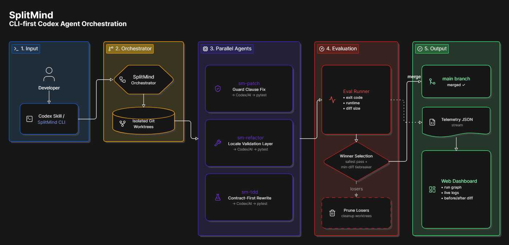

# 🧠 SplitMind

**CLI-first Codex agent orchestration for safer autonomous code changes.**

SplitMind runs multiple AI coding strategies in isolated Git worktrees, evaluates each branch with real tests, selects the safest passing solution, merges the winner into `main`, and prunes the losing branches.

> Do not ask one agent for one guess. Run competing strategies, test them, and merge only the validated result.

## 🎯 What It Does

Single-path AI coding is fragile: one bad architecture choice can over-refactor, hallucinate, or silently break behavior. SplitMind treats coding as a tested tournament:

1. Accept a developer task from the CLI or Codex Skill.
2. Create isolated Git worktrees.
3. Run parallel agent strategies.
4. Execute the configured test command in every branch.
5. Select the best passing branch using deterministic signals.
6. Merge the winner into `main`.
7. Prune failed or non-winning worktrees.
8. Write telemetry/results for inspection in the dashboard.

## 🏗️ Architecture



```text
Task -> SplitMind CLI/Skill -> Orchestrator -> Git worktrees
     -> Parallel agents -> Test runner -> Winner selection
     -> Merge to main -> Telemetry dashboard
```

## ⌨️ CLI

SplitMind is controlled from the CLI. The web dashboard is optional telemetry; the CLI owns worktrees, tests, winner selection, and merge policy.

Initialize local config:

```bash
python splitmind.py init
```

Run a swarm:

```bash
python splitmind.py run "Fix the corrupted payment gateway implementation and preserve all payment contract tests."
```

Prepared demo shortcut:

```bash
python splitmind.py demo
```

Inspect the latest run:

```bash
python splitmind.py status
python splitmind.py results
python splitmind.py results sm-tdd
```

Check prerequisites:

```bash
python splitmind.py doctor
```

Clean stale worktrees:

```bash
python splitmind.py clean
```

## 🎛️ Configuration

SplitMind reads `.splitmind.json` when present.

```json
{
  "repo_dir": "../ecommerce_demo",
  "target_file": "src/payment_gateway.py",
  "test_command": "python -m pytest tests/ -v --tb=short --no-header",
  "results_dir": "../ecommerce_demo",
  "base_branch": "main",
  "strategies": "Locale Validation Layer|Guard Clause Fix|Contract-First Rewrite"
}
```

The important knobs are:

- `repo_dir`: repository SplitMind should branch with Git worktrees
- `target_file`: file agents should repair or rewrite
- `test_command`: deterministic evaluator
- `strategies`: pipe-separated strategy names
- `results_dir`: where `.splitmind_results.json` is written

## 📊 Dashboard

The Next.js dashboard is a telemetry and demo surface. It helps humans inspect the autonomous loop:

- branch and agent status
- winner vs tiebreak-pruned vs failed branches
- before/after generated code
- changed lines
- test output and exit code
- final merge decision

Run locally:

```bash
cd splitmind-frontend
npm run dev
```

Then open `http://localhost:3000`.

The hosted Vercel app is a browser-safe demo replay because real orchestration needs local filesystem, Git worktree, Python, and test runner access.

## 🔌Agent Adapters

SplitMind can be exposed to different agentic coding tools as a thin instruction layer over the same CLI:

- Codex Skill: `my-skill/SKILL.md` or `adapters/codex/SKILL.md`
<!-- - Claude project command/instruction: `adapters/claude/splitmind.md`
- Cursor rule: `adapters/cursor/splitmind.mdc` -->

All adapters route complex coding tasks back to:

```bash
python splitmind.py run "<task>"
```

This keeps merge policy, test validation, and worktree cleanup centralized in the CLI instead of duplicating behavior across editors.

## 🚀 Prototype Scope

The hackathon prototype demonstrates the full loop on a controlled payment-gateway bug scenario. It already supports:

- CLI-driven orchestration
- Codex Skill packaging
- configurable strategies
- configurable repo, target file, test command, and base branch
- real Git worktrees
- real pytest evaluation
- winner selection and merge
- dashboard inspection of results

Next steps:

- broader multi-file repository support
- richer merge policies
- better conflict recovery
- installable `splitmind` package entrypoint
- deeper Codex worker integration
